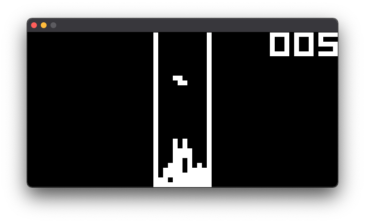
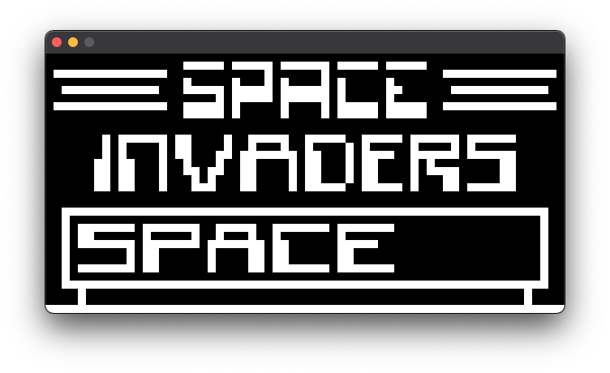
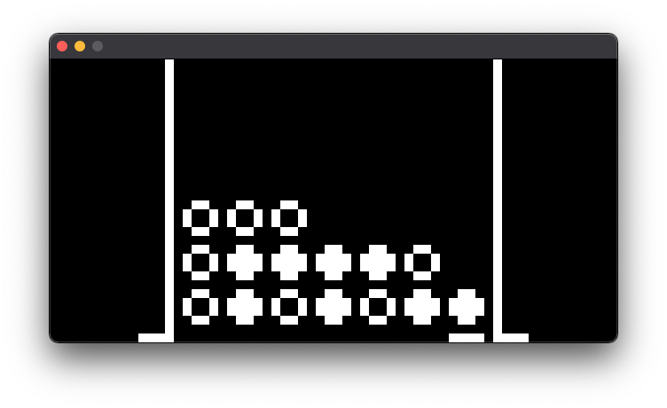
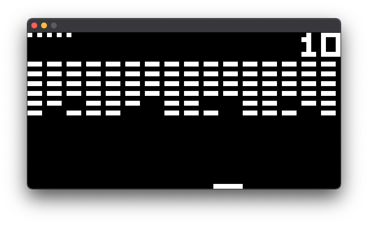

# chip8emu
An implementation of a CHIP-8 emulator in C utilizing SDL for audio/graphics/input. 

# CHIP8
CHIP8 is an interpreted programming language built in the 1970s. It is home to many ports of classic games such as PONG, SPACE INVADERS and TETRIS. Over the years, it has become a staple in the emulator developer community, thanks to the relatively simple structure of the system and low number of CPU opcodes. 

# Usage
SDL2 and SDL_Sound required.
The Makefile has a simple command to compile with gcc. I have only tested the program on MacOS Big Sur 11.2.1, but due to the many platforms SDL and GCC support, it should be trivial to get working on other systems.

Simply clone this repository and run the Makefile with:

    make chip8
    
It should create an executable. To load a ROM and run:

    ./chip ROM_NAME
